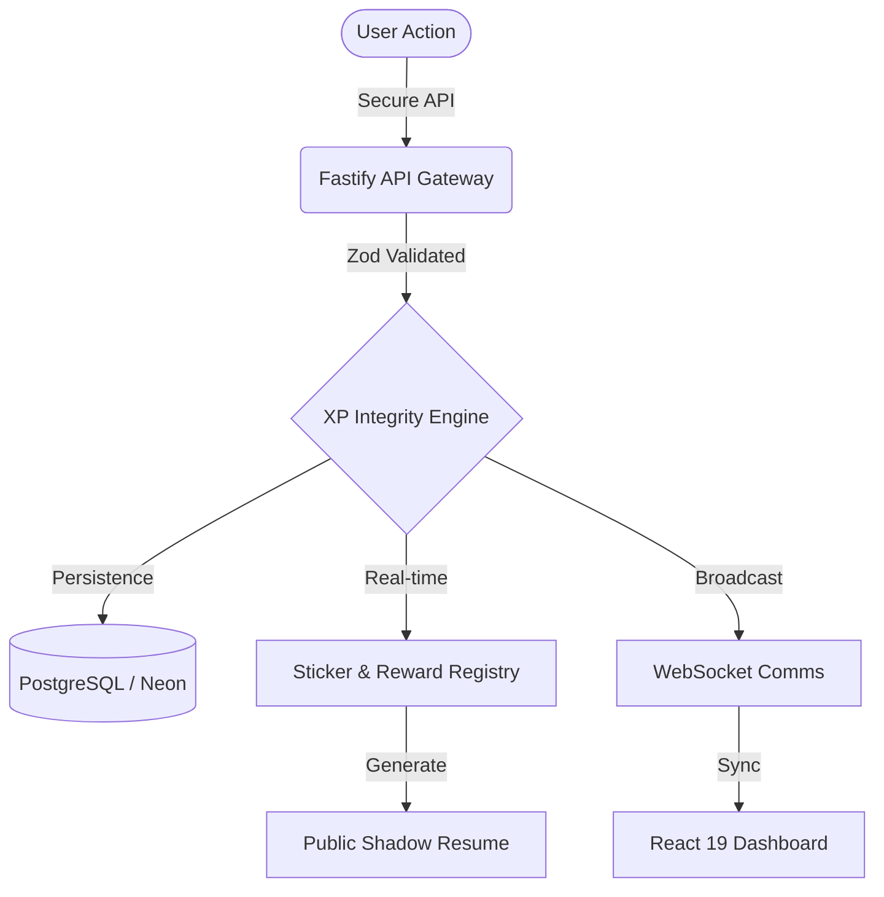

<div align="center">
  

  # Aptico
  ### The Enterprise-Grade Engine for Career Resilience & Gamified Progression

  [](https://github.com/VivekYadav-77/Aptico)
  [](https://www.gnu.org/licenses/agpl-3.0)
  [](https://github.com/VivekYadav-77/Aptico)
  [](https://deepmind.google/technologies/gemini/)

  **Aptico** is a high-performance ecosystem engineered to solve "Application Fatigue" through advanced behavioral psychology and data-driven resilience tracking.
</div>

---

## 🎯 The Vision

The modern job market is a marathon of attrition. **Aptico** transforms this quantitative "grind" into a qualitative "journey." By leveraging an event-driven XP engine, we help professionals maintain momentum, track their grit, and visualize the persistence behind every milestone.

> "It's not about the destination; it's about the resilience built along the way."

---

## 🚀 Core Features

### 🎮 Psychological Gamification
- **XP Integrity Engine (Core V3)**: A proprietary validation layer that calculates XP based on activity depth, streak consistency, and recovery speed from rejections.
- **Dynamic Sticker System**: Unlockable achievements (SVG & CSS-driven rarity) that commemorate specific milestones, from "First Application" to "Resilience King."
- **Leveling Hierarchy**: A multi-tier progression system that visualizes professional growth beyond the traditional resume.

### 📊 Resilience Analytics (Grit Data)
- **Dynamic Grit Heatmaps**: High-performance SVG rendering of 365-day application activity, turning "rejections" into a visual testament of effort.
- **Shadow Resumes**: Automated secondary profiles that highlight the learning and persistence behind professional achievements.
- **Momentum Tracking**: Real-time visualization of daily/weekly velocity to identify and prevent burnout before it happens.

### 🤝 Collaborative Ecosystem
- **Tactical Squad Systems**: Join or form squads to share momentum, aggregated metrics, and collective morale.
- **Squad Momentum Hub**: Real-time WebSocket-backed coordination tools to keep the team motivated.
- **Anonymous Squad Chat**: Low-friction, tactical communication for squad-level strategy and support.

---

## 🏗 System Architecture

Aptico is built on a distributed, event-driven architecture designed for zero-latency feedback and high data integrity.



---

## 🧰 The Modern Tech Stack

| Layer | Technology | Rationale |
| :--- | :--- | :--- |
| **Frontend** | **React 19 + Vite 8** | Leveraging Concurrent Mode and sub-millisecond build times. |
| **Styling** | **Tailwind CSS 4** | Next-generation utility-first CSS with optimized engine. |
| **State** | **TanStack Query v5** | Advanced server-state synchronization with optimistic updates. |
| **Backend** | **Fastify** | 2x performance compared to Express with native schema validation. |
| **Database** | **Drizzle + Neon** | Serverless, type-safe SQL with zero-overhead migrations. |
| **AI Layer** | **Google Gemini** | LLM integration for resume optimization and resilience insights. |
| **Comms** | **WebSockets (Fastify)** | Real-time squad coordination and state synchronization. |

---

## 📂 Repository Standards

```bash
├── backend/
│   ├── scripts/        # Production-grade migration & verification tools
│   ├── src/config/     # Engine-specific configurations (Drizzle, Gemini)
│   └── src/services/   # Decoupled business logic (XP, AI, Social, Comms)
├── frontend/
│   ├── src/api/        # Centralized TanStack Query hooks & interceptors
│   ├── src/components/ # Atomic design system with premium glassmorphic tokens
│   ├── src/store/      # Redux Toolkit for complex local UI state
│   └── src/utils/      # Deterministic sticker & rarity registries
```

---

## 🚦 Getting Started

### 1. Prerequisites
- Node.js (v20+ recommended)
- A PostgreSQL instance (Neon.tech recommended)
- Google Gemini API Key

### 2. Environment Setup
Create a `.env` file in both `backend/` and `frontend/` directories.

**Backend (`backend/.env`):**
```env
DATABASE_URL=your_postgres_url
JWT_SECRET=your_secure_secret
GEMINI_API_KEY=your_gemini_key
SQUAD_COMMS_ENABLED=true
```

### 3. Installation & Boot
```bash
# Install dependencies
npm install

# Initialize Database
cd backend
npm run db:push

# Start Development Servers
# Terminal 1: Backend
npm run dev

# Terminal 2: Frontend
cd ../frontend
npm run dev
```

---

## 🛡 Security & Performance
- **Enterprise-Grade Protection**: Implements `Helmet` and `Fastify-Rate-Limit` for XSS and brute-force mitigation.
- **Sub-50ms Latency**: Core XP endpoints are optimized for maximum throughput.
- **Lighthouse Excellence**: Engineered for 95+ scores across Performance, SEO, and Accessibility.

---

## 🤝 Contributing

We welcome contributions from engineers who are passionate about behavioral psychology and career development.
1. Fork the Project
2. Create your Feature Branch (`git checkout -b feature/AmazingFeature`)
3. Commit your Changes (`git commit -m 'Add some AmazingFeature'`)
4. Push to the Branch (`git push origin feature/AmazingFeature`)
5. Open a Pull Request


---

<div align="center">
  <sub>Developed with ❤️ by <a href="https://github.com/VivekYadav-77">Vivek Yadav</a> & the Aptico Engineering Team.</sub>
</div>