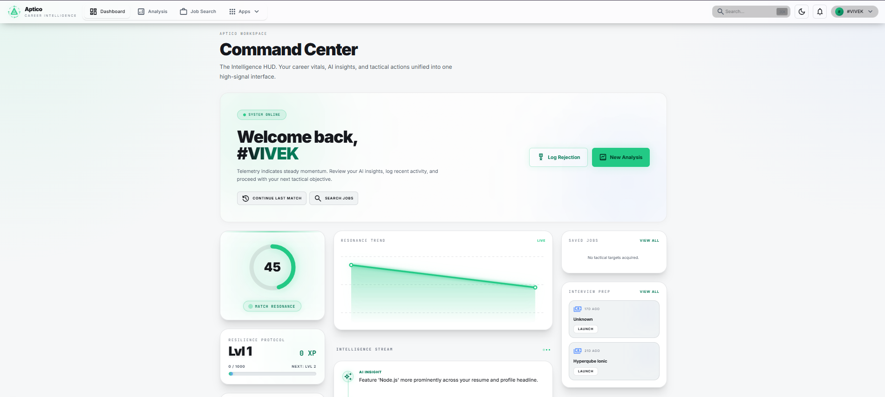
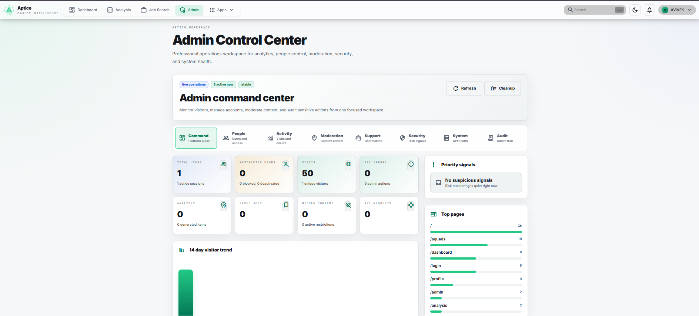
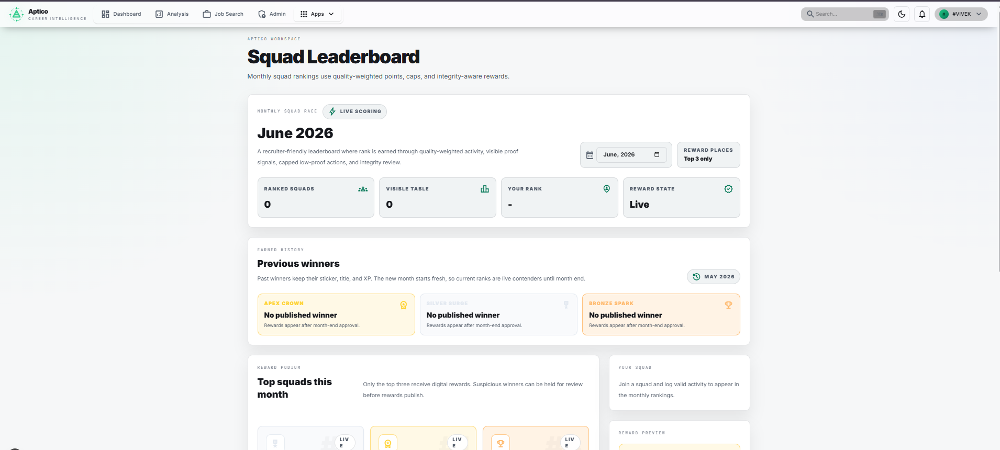
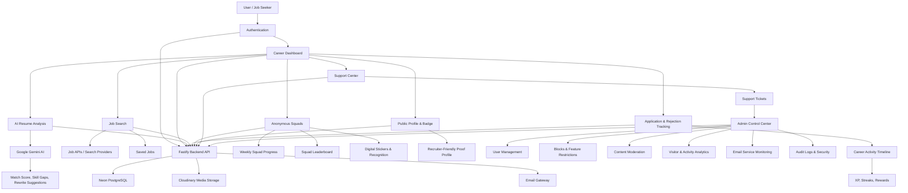
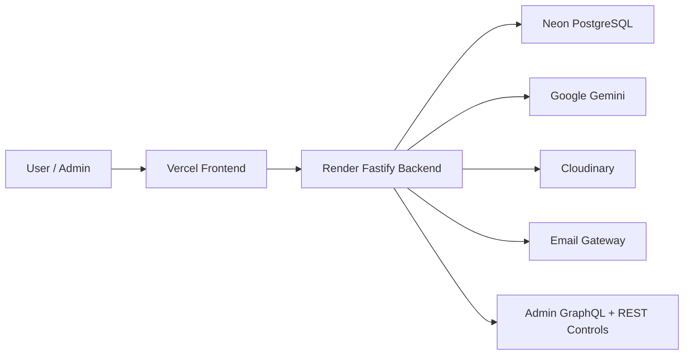

<div align="center">


# Aptico

### 🚀 Career intelligence for smarter job searching, resume analysis, and application momentum.

Aptico helps job seekers turn a messy job search into a structured workflow: analyze resumes, discover better-fit roles, save jobs, track applications and rejections, join anonymous accountability squads, and build a recruiter-friendly proof profile.

</div>

<p align="center">
  <a href="#what-is-aptico">Product</a> |
  <a href="#screenshots">Screenshots</a> |
  <a href="#core-features">Features</a> |
  <a href="#admin-control-center">Admin</a> |
  <a href="#tech-stack">Tech Stack</a> |
  <a href="#run-locally">Run Locally</a>
</p>

<p align="center">
  
  
  
  
  
</p>

---

## 🧭 What Is Aptico?

Aptico is built for people who are applying to jobs, improving their resume, preparing for interviews, and trying to stay consistent through a long hiring process.

Instead of treating job search as random applications and scattered notes, Aptico gives users one place to:

- 🎯 Understand how well their resume matches a role.
- 🔎 Find and save relevant jobs.
- 📌 Track applications, rejections, and progress.
- 🤝 Stay accountable through anonymous squads.
- 🧾 Build a public profile that shows effort, skills, and career momentum.
- 🛟 Contact support when account, restriction, or platform issues appear.

For a recruiter or engineering reviewer, Aptico also demonstrates a real-world product system: authentication, admin controls, analytics, support workflows, moderation, audit logs, email monitoring, security rules, and production deployment planning.

---

## 📸 Screenshots


### 🧑‍💼 User Dashboard Preview

<picture>
  <source media="(prefers-color-scheme: dark)" srcset="docs/screenshots/user-dark.png">
  <source media="(prefers-color-scheme: light)" srcset="docs/screenshots/user-light.png">
  
</picture>

### 🛡️ Admin Operations Preview

<picture>
  <source media="(prefers-color-scheme: dark)" srcset="docs/screenshots/admin-dark.png">
  <source media="(prefers-color-scheme: light)" srcset="docs/screenshots/admin-light.png">
  
</picture>

### 🏆 Squad Leaderboard Preview

<picture>
  <source media="(prefers-color-scheme: dark)" srcset="docs/screenshots/leaderboard-dark.png">
  <source media="(prefers-color-scheme: light)" srcset="docs/screenshots/leaderboard-light.png">
  
</picture>

---

## 💡 Why It Exists

Job searching is often unstructured.

People apply to many roles, lose track of where they applied, receive vague rejections, and do not always know how to improve their resume. Over time, that creates fatigue.

Aptico turns that process into a guided system. It helps users understand their fit for a role, choose better applications, record progress, recover from rejection, and keep moving with support from small anonymous squads.

---

## ✨ Core Features

### 🤖 AI Resume Analysis

Users can upload a resume and compare it against a target job description. Aptico returns match signals, skill gaps, keyword mismatches, rewrite ideas, and practical next steps.

### 🔎 Job Search Intelligence

Users can search roles, filter opportunities, inspect job quality signals, and save jobs for later review.

### 📌 Application And Rejection Tracking

Aptico lets users log applications and rejections so progress does not disappear. The platform turns job-search activity into visible momentum.

### 🤝 Anonymous Squads

Users can join a squad to share progress without exposing personal identity. Squads help users stay consistent through weekly goals, pings, and shared accountability.

### 📊 Career Dashboard

The dashboard gives users a single overview of analysis results, activity, saved jobs, XP, progress, and recommended next actions.

### 🧾 Public Profile And Badge

Users can build a public profile and generate recruiter-friendly proof of their activity, projects, skills, and career resilience.

### 🛟 Support Center

Logged-in and public users can contact support for account access, restrictions, email issues, or platform problems.

---

## 🛡️ Admin Control Center

Aptico includes a full admin workspace designed like a real operational product, not just a demo panel.

Admins can monitor and manage:

- 📈 Visitors and platform activity.
- 👥 Users, roles, sessions, account status, and restrictions.
- ⛔ Feature-level blocks such as posting, commenting, analysis, job search, job saving, squad actions, and login access.
- 🧹 Content moderation and hidden content.
- 🎫 Support tickets, internal notes, assignment, escalation, resolve, close, and reopen actions.
- ✉️ Email service usage and email blocks.
- 🔐 Security signals, suspicious activity, API errors, and admin audit logs.
- 🩺 System health and production readiness.

Sensitive admin actions require reasons, confirmations, and audit records.

---

## 🧰 Tech Stack

| Layer | Technology |
| --- | --- |
| Frontend | Next.js, React, Tailwind CSS |
| Backend | Node.js, Fastify |
| Database | PostgreSQL, Drizzle ORM, Neon |
| AI | Google Gemini |
| Auth | JWT, refresh sessions, CSRF protection |
| Media | Cloudinary |
| Email | Google Apps Script email gateway |
| Deployment | Vercel frontend, Render backend, Neon database |
| Admin Data | REST APIs and admin GraphQL |

---

## 🏗️ Architecture

### 🔄 Product Flow



### 🧱 System Architecture



The frontend uses Vercel rewrites for `/api/*` and `/admin/graphql`, keeping browser requests same-origin where possible. Production secrets stay on the backend.

---

## 🔐 Security And Production Readiness

Aptico includes:

- 🛡️ Admin-only route protection.
- 🔑 CSRF protection for auth flows.
- 🚦 Rate limiting.
- 🌐 Strict CORS allowlists.
- ✅ Secure production environment validation.
- 🕵️ Privacy-safe analytics.
- 🧾 Audit logs for sensitive admin actions.
- 🔒 No raw IP display in admin analytics.
- 🖼️ Cloudinary-backed permanent media storage.
- ⏱️ Optional Render keep-alive workflow for normal usage hours.

The app continues to work without the keep-alive workflow; only cold-start behavior changes.

---

## 📁 Repository Structure

```text
backend/
  scripts/              migration and integration utilities
  src/app/              Fastify bootstrap and route registration
  src/config/           environment and Drizzle config
  src/db/               database schema
  src/modules/          feature modules
  src/shared/           middleware, security, services, utilities
  test/                 backend tests

frontend/
  public/               static assets
  src/app/              Next.js routes and providers
  src/api/              browser-safe API clients
  src/components/       reusable UI components
  src/features/         larger feature-owned areas
  src/screens/          route-level product screens
  src/store/            Redux state
  src/utils/            browser utilities
```

---

## ⚙️ Run Locally

### Prerequisites

- 🟢 Node.js 20 or newer
- 🗄️ PostgreSQL database, Neon recommended
- 🤖 Google Gemini API key
- 🖼️ Cloudinary account for profile banner uploads

### Backend

```bash
cd backend
npm install
cp .env.example .env
npm run db:setup
npm run dev
```

### Frontend

```bash
cd frontend
npm install
cp .env.example .env
npm run dev
```

Frontend runs on:

```text
http://localhost:3000
```

Backend runs on the configured backend port.

---

## 🚀 Key Environment Notes

Backend production requires:

```text
DATABASE_URL
JWT_SECRET
FRONTEND_URL
SECURITY_MODE=production
```

For deployment:

```text
FRONTEND_URL=https://your-vercel-domain.vercel.app
ALLOWED_ORIGINS=https://your-custom-domain.com
CLOUDINARY_CLOUD_NAME=...
CLOUDINARY_API_KEY=...
CLOUDINARY_API_SECRET=...
```

Recommended frontend production setup:

```text
API_PROXY_TARGET=https://your-render-service.onrender.com
NEXT_PUBLIC_API_BASE_URL=/
```

More deployment details are available in `DEPLOYMENT.md`.

---

## 🚀 Future Enhancements

### Intelligent Job Discovery Engine

- Build a scalable job aggregation system that continuously collects opportunities from public career pages and supported job sources.
- Add automated ingestion pipelines with deduplication, validation, normalization, and quality checks so listings stay useful instead of noisy.

### AI-Powered Job Matching

- Introduce personalized job recommendations based on user skills, experience level, preferred locations, work model, and career interests.
- Generate job match scores with clear explanations for matching skills, missing skills, role-fit signals, and suggested next actions.

### Resume Intelligence

- Expand resume-to-job analysis with deeper compatibility scoring for specific roles, teams, and seniority levels.
- Provide actionable recommendations for stronger bullet points, ATS compatibility, skill positioning, and application success rate improvement.

### Smart Job Alerts

- Deliver timely notifications for newly discovered opportunities that match user-defined preferences, skills, saved searches, and career goals.
- Allow users to tune alert frequency so notifications stay helpful and do not become noise.

### Custom Squad Dashboard

- Add a dedicated squad workspace where users can see squad progress, weekly targets, member activity, shared milestones, and accountability signals in one focused dashboard.
- Support clear join and exit flows so users can enter a squad, leave when needed, and understand how their progress affects squad totals.
- Add admin-visible squad health controls for monitoring inactive squads, unusual activity, and leaderboard integrity.

### Advanced Search And Ranking

- Develop a relevance-based ranking engine that prioritizes jobs using skill alignment, experience requirements, location preferences, salary range, posting freshness, and user behavior signals.
- Add saved search profiles so users can quickly switch between different career paths or role categories.

### Application Analytics Dashboard

- Track application performance through response rate, interview conversion rate, rejection patterns, offer conversion rate, and role-fit trends.
- Provide insights that help users adjust their resume, target better roles, and improve their job-search strategy over time.

### Company Intelligence

- Enrich job listings with company-specific context such as hiring trends, work models, technology stacks, role stability, and public career-page activity.
- Help users understand not only whether a role fits, but whether the company environment matches their goals.

### Scalable Background Processing

- Introduce queue-based worker services for job ingestion, indexing, recommendation generation, analytics processing, notifications, and scheduled cleanup tasks.
- Keep expensive processing outside user-facing requests so the product remains responsive as data volume grows.

### Platform Reliability And Monitoring

- Expand logging, monitoring, health checks, alerting, and recovery workflows for stronger production reliability.
- Add deeper operational dashboards for background jobs, email delivery, API latency, failed tasks, and service availability.

---

## 👥 Team

### Vivek Yadav

 Full-stack Product Engineer. Co-owner of the Aptico platform with focus on product architecture, AI workflows, backend systems, user experience, and recruiter-facing career intelligence.

- GitHub: [VivekYadav-77](https://github.com/VivekYadav-77)
- LinkedIn: [vivekyadav94](https://www.linkedin.com/in/vivekyadav94/)
- Email: vivekyadav.dev007@gmail.com

### Shivang Rai

 Full-stack Product Engineer. Co-owner of the Aptico platform with focus on platform operations, admin control systems, support workflows, user safety, monitoring, and product quality.

- GitHub: [shivangrai5143](https://github.com/shivangrai5143)
- LinkedIn: [shivang-rai11](https://www.linkedin.com/in/shivang-rai11)
- Email: raishivang69@gmail.com

---

## 📄 License

This project is licensed under the AGPL-3.0 License. See `LICENSE` for details.
